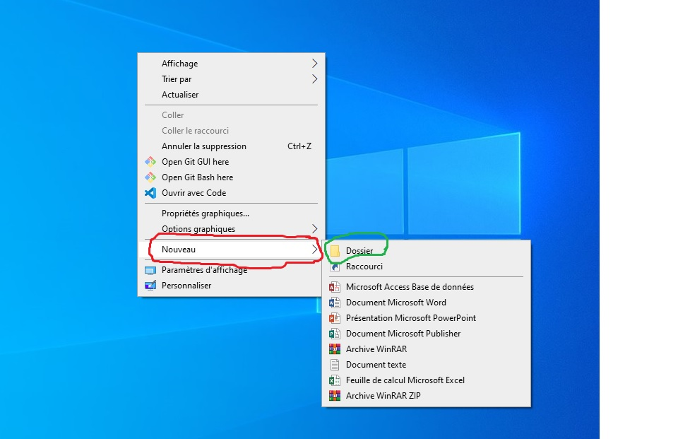
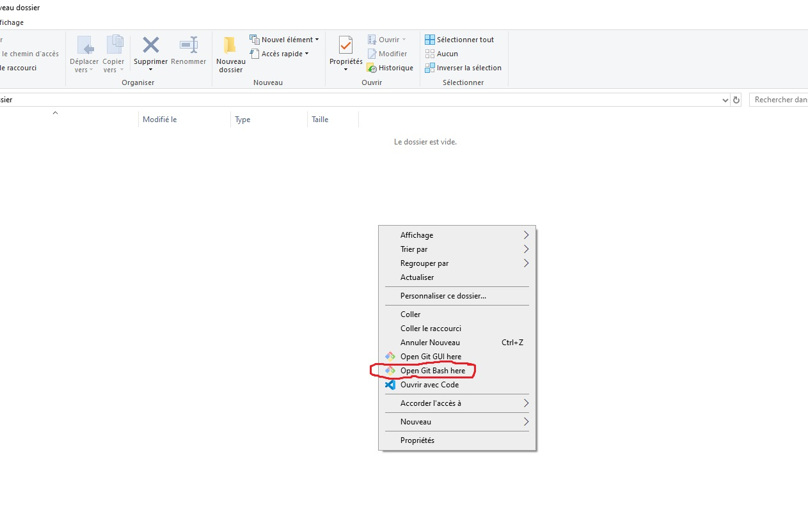
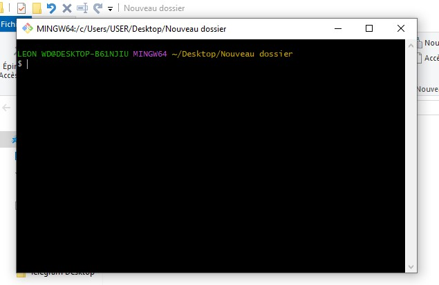
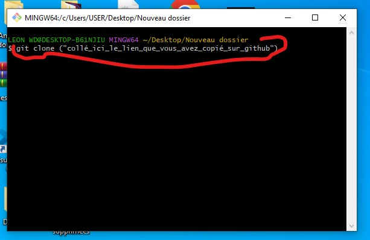

# tech-vacances
This repository Is for people Learning python as fast as possible for data science 
Ce repositrie est destiné à tout ceux qui désirent apprendre le langage python dans la mesure du possible pour la data science.
Pour avoir ce repositrie sur votre PC , vous devez suivre les étapes suivantes :
1. Télécharger l'application "Github" en cliquant sur ce lien : (https://gitforwindows.org/) voici l'image du github en question :
2. Après l'installation de Github , vous irez sur le site officiel de git hub en cliquant sur ce lien : (https://github.com/) et vous créerez un compte github en remplissant juste quelques informations vous concernant ,
3. Après la création de votre compte github , taper dans la barre de recherche dans github : "Essoh21" et cliquer sur le repositrie en question ,
4. Après avoir cliqué sur le repositrie en question , vous verrez en haut à gauche un espace vert ou il est écrit : "code" , vous cliquerai dessus et vous copierai le lien ,
5. Après cela , vous reviendrai sur votre bureau pour créer un nouveau dossier auquel vous donnerez un nom(ça dépend de vous) , pour créer un nouveau dossier , c'est très simple vous faites clique droit sur l'espace vide sur le bureau :
6. Ensuite vous ouvrirez votre nouveau dossier que vous venez de créer et vous ferez un clique droit dans la partie vide dans le dossier : et vous choisirez : "Open Git Bash here"
7. Après avoir cliqué sur "Open Git Bash here" vous serez dirigé vers Git : 
8. Ensuite vous allez taper "git clone ("collé_ici_le_lien_que_vous_avez_copié_sur_github") :
9. ça va afficher "cloning" , vous patienter et après cette étape , vous aurez le repositrie dans votre nouveau dossier que vous avez crée sur votre ordinateur .

